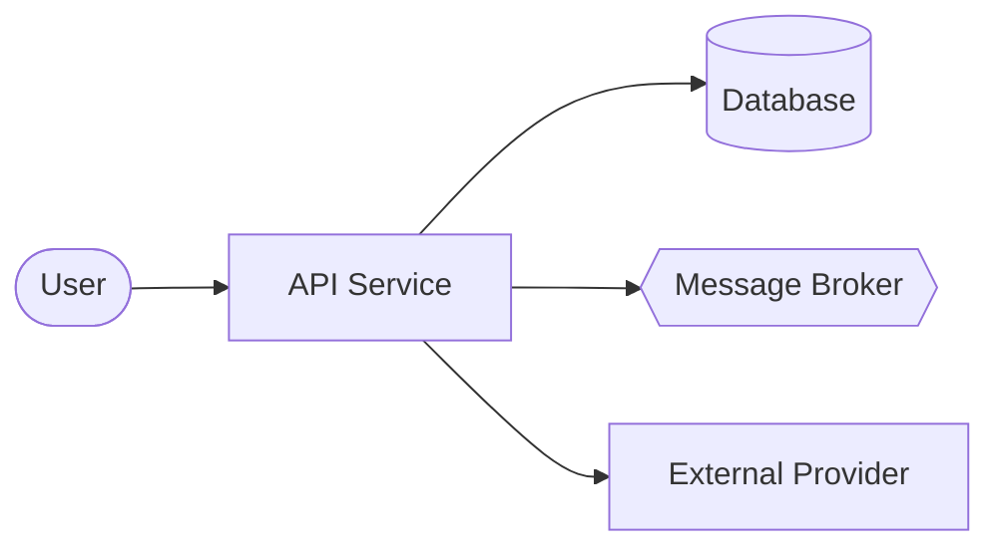
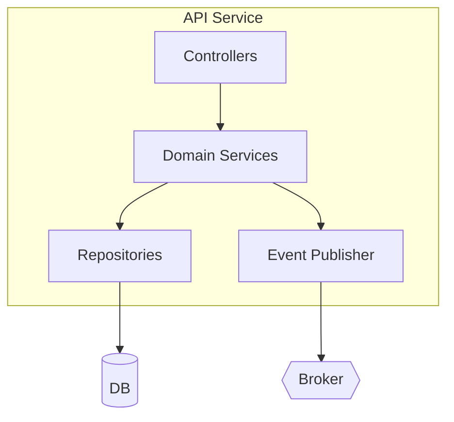
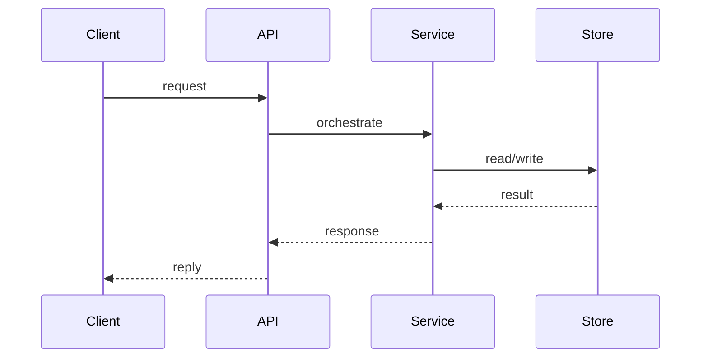
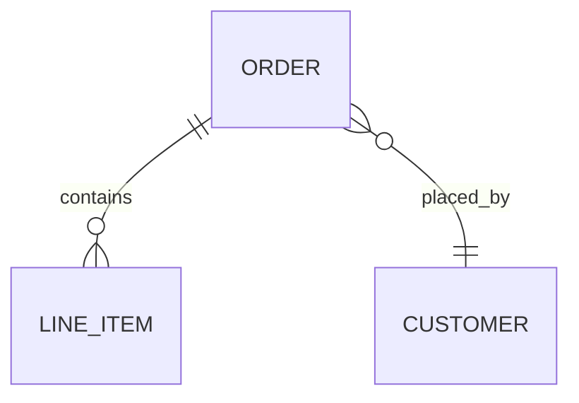

# Technical documentation

Audience: engineers who will maintain or extend the system. Answers "how is it
built, and why is it built that way?" Every section is grounded in cited source.

## Document template

Use this structure. Drop sections that genuinely don't apply (say so rather than
padding). Keep diagrams in Mermaid so they render in-repo and diff cleanly.

```markdown
# <Project> — Technical Documentation
_Generated <date>. Based on commit/branch <ref if known>._

## 1. Overview
Three sentences: what the system is, its primary responsibility, and its stack.

## 2. Architecture (C4)
### 2.1 Context (C4 L1) — the system and its external actors/systems
### 2.2 Containers (C4 L2) — deployable/runnable units and how they talk
### 2.3 Components (C4 L3) — internal modules of the main container(s)
(Include a Mermaid diagram per level. L4/code is usually unnecessary.)

## 3. Component reference
For each significant module: responsibility, key types/entry symbols (cited),
inbound/outbound dependencies, and notable design choices.

## 4. Data model
Entities/schemas, relationships, persistence tech, migrations, serialization
formats, and lifecycle/TTL if relevant. Mermaid ER diagram where it helps.

## 5. Key flows (sequence diagrams)
For each critical flow traced in Phase 3: a sequence diagram + a short narrative
with file/symbol citations for each hop.

## 6. Cross-cutting concerns
Config, auth/security, error handling, concurrency/async model, observability
(logging/metrics/tracing), resilience (retries/timeouts/backpressure).

## 7. Build, test & run
How to build, test, and run locally; environments; CI/CD topology; key env vars.

## 8. Architecture Decision Records (inferred)
One entry per significant structural choice — see ADR template below.

## 9. Confidence & open questions
Everything you could not verify against source, and the risks it implies.
```

## C4 in Mermaid — patterns

Context / container (use flowchart for portability):


Component level:


Sequence (a flow):


Entity relationships:


## ADR template (for inferred decisions)

```markdown
### ADR-<n>: <decision title>
- **Status:** Inferred from code (not an original ADR) | Documented
- **Decision:** What the codebase actually does.
- **Evidence:** Files/symbols that show it (cited).
- **Forces (inferred):** Constraints/goals that plausibly drove it.
- **Consequences:** Trade-offs this creates for maintainers.
- **Confidence:** High/Medium/Low — and what would confirm it.
```

Mark inferred rationale clearly. It is fine — and valuable — to say "the code
enforces X; the reason is not documented and appears to be Y." Never present a
guess as a recorded decision.

## Citation style
Reference source as `path/to/file.ext:Symbol` or `path/to/file.ext:L120`. Prefer
a stable symbol name over a line number when the code may move. Group multiple
citations for one claim rather than sprinkling.
